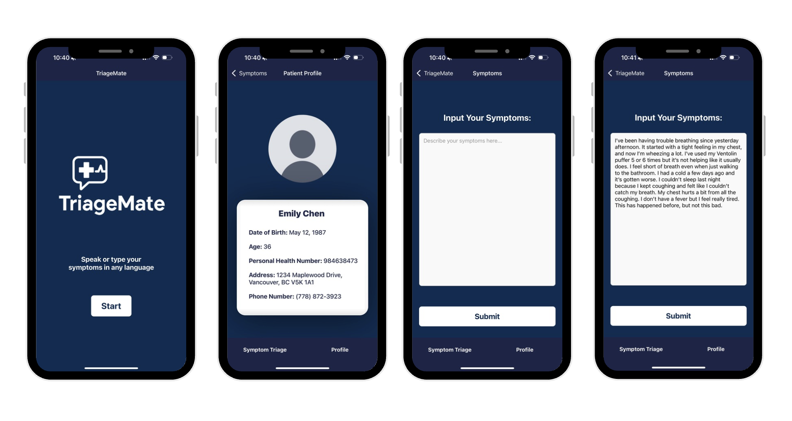
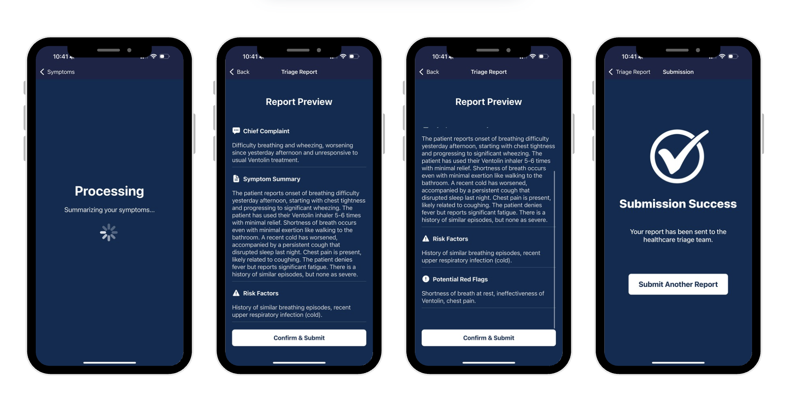
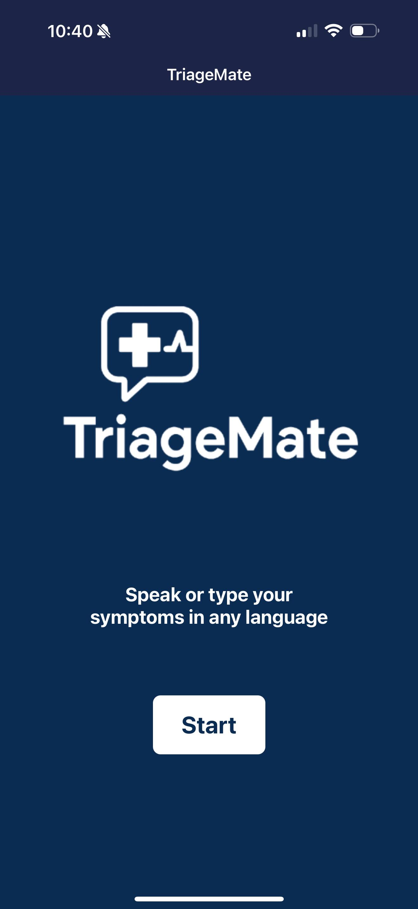
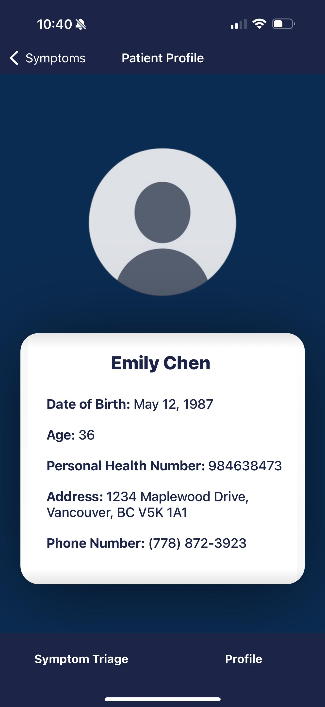
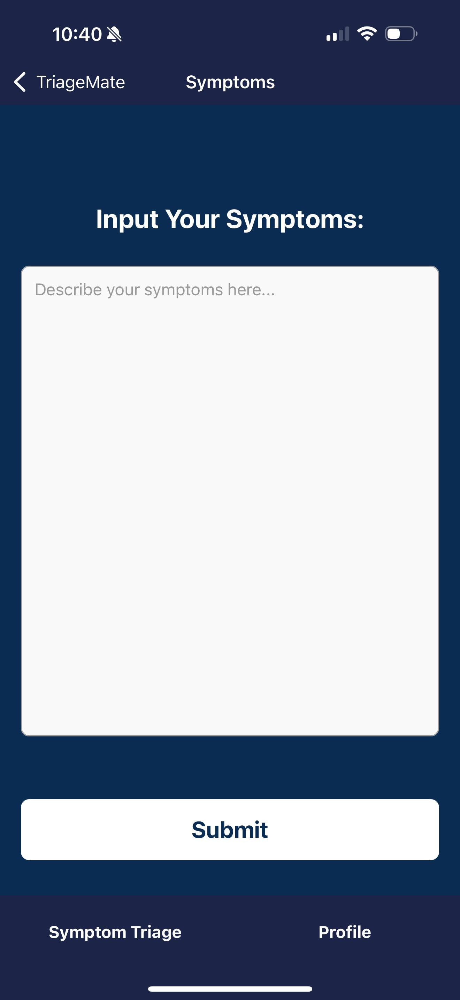
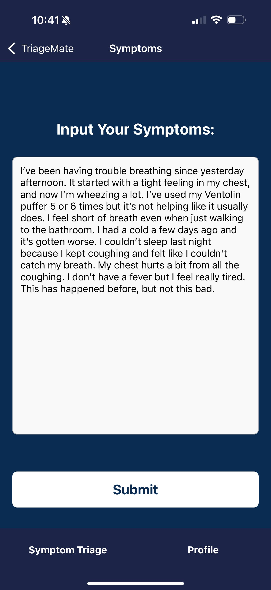
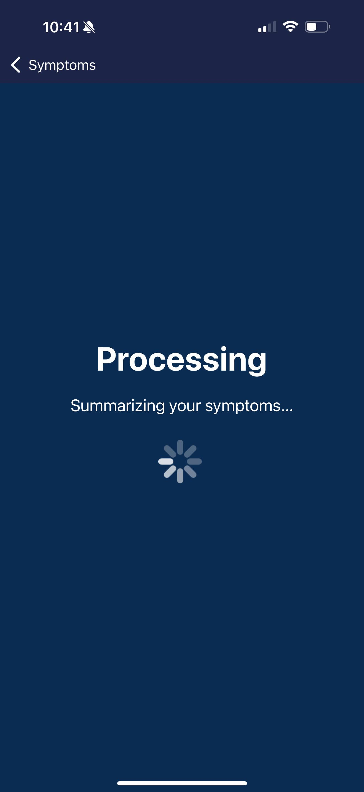
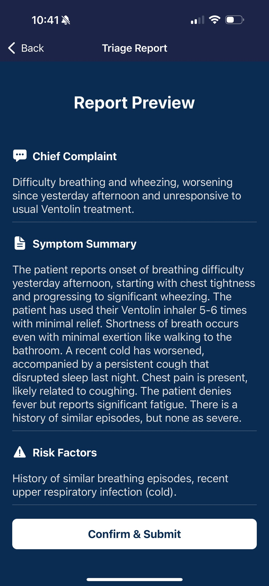
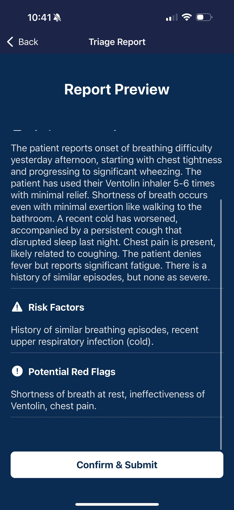
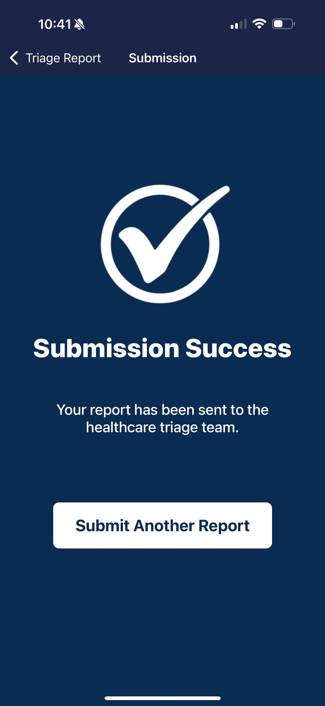

<h1 align="center">
  TriageMate
</h1>

<h2 align="center">
  An AI-powered symptom translation and parser for more efficient hospital triage - Empowering patients, supporting providers
</h2>

Devpost link: https://devpost.com/software/TriageMate

<p align="center">
  
</p>


<br>

## Contributors
- Vincent Tu
- Jennifer Wong
- Stephanie Xue
  
<br>

## Inspiration
Communicating health concerns can be overwhelming — especially when symptoms are complex, emotions run high, or language barriers exist. We believe that everyone deserves to be heard and understood, no matter how they express themselves. Inspired by the need for clearer, more accessible healthcare communication, we set out to build something that bridges the gap between patients and providers. Our goal was to turn unstructured, everyday speech from any language (spoke or text-based) into structured, meaningful reports that streamline care and improve triage. Through TriageMate, we aim to empower individuals to speak freely, in any language, and ensure that their needs are captured accurately and compassionately — helping healthcare professionals deliver the right care, faster.

<br>

## What it does
TriageMate is an AI-powered hospital triage assistant that streamlines symptom reporting and risk assessment — where smart tech meets compassionate care. Our application transforms the traditional triage experience by enabling users to describe their symptoms through voice or text in any language, which is then intelligently translated, analyzed, and structured into a concise report for healthcare providers. Whether you're managing patient flow, reducing language barriers, or enhancing clinical decision-making, TriageMate empowers both patients and healthcare teams with faster, smarter, and more accessible triage.
<br>
<br>
Users can:
  - Log

<br>

<p align="center">
  
</p>

<p align="center">
  
</p>

## Features

### Landing screen
- Welcomes the user
<p align="center">
  
</p>

### Profile screen
- Allows
<p align="center">
  
</p>

### Symptom input screen
- Allows

<p align="center">
  
  &nbsp;&nbsp;&nbsp;&nbsp;&nbsp;&nbsp;&nbsp;&nbsp;&nbsp;&nbsp;
  
</p>


### Processing screen
- Allows 
<p align="center">
  
</p>

### Triage results screen
- Allows 
<p align="center">
  
  &nbsp;&nbsp;&nbsp;&nbsp;&nbsp;&nbsp;&nbsp;&nbsp;&nbsp;&nbsp;
  
</p>


### Submission successs screen
- Allows 
<p align="center">
  
</p>

<br>

## How we built it
- Front-end: The frontend was built with 
- Back-end & database: We developed this application using 

<br>

## Challenges we ran into
Some challenges we ran into include 

<br>

## Accomplishments that we're proud of
One of our biggest achievements was 

<br>

## What we learned
We gained valuable insights into 

<br>

## What's next for TriageMate
For TriageMate,


## How to Run Locally (Frontend & Backend)
- Install the latest version of node
    - Check the version using the command
        - ```node --version```
- Install Expo CLI by using the command
    - ```npm install -g expo-cli```
- Download the Expo Go app on your phone (iOS/Android devices)
- Clone the repository from github by typing in the command line
    - HTTPS: ```git clone https://github.com/steph-xue/TriageMate.git```
    - SSH: ```git clone git@github.com:steph-xue/TriageMate.git```
- Install any dependencies by using the command
    - ```npm install```
- Start the frontend Expo Server by typing in the command line
    - ```npx expo start```
- Start the backend server by typing in the command line
    - ```node app.js```
- It will provide you a url for the local host to view it from your computer and a QR code to run it on your phone
- Scan the QR code using your phone camera to open the application in your Expo Go app
